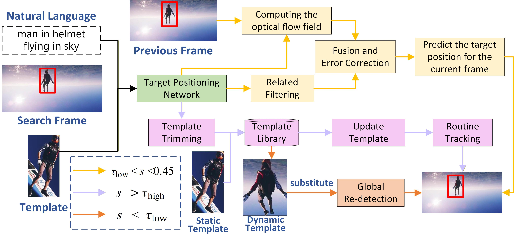

# METrack
# A Multi-modal Long-term Target Tracking Method Based on Motion Estimation




## Install the environment
Use the Anaconda
```
conda create -n METrack python=3.6
conda activate METrack
cd METrack
pip install -r requirements.txt
```

## Data Preparation
Put the tracking datasets in ./data. It should look like:
   ```
   ${METrack_ROOT}
    -- data
        -- lasot
            |-- airplane
            |-- basketball
            |-- bear
            ...
        -- lasotext
            |-- atv
            |-- badminton
            |-- cosplay
            ...
        -- got10k
            |-- test
            |-- train
            |-- val
        -- coco
            |-- annotations
            |-- train2017
        -- trackingnet
            |-- TRAIN_0
            |-- TRAIN_1
            ...
            |-- TRAIN_11
            |-- TEST
        -- otb99
            |-- OTB_query_test
            |-- OTB_query_train
            |-- OTB_videos
        -- refcocog
            |-- refcocog
            |-- split # download this folder from VLTVG (https://github.com/yangli18/VLTVG/blob/master/docs/get_started.md)
            |-- train2014 # coco 2014
            |-- val2014 # coco 2014
        -- tnl2k
            |-- test
            |-- train
   ```

## Train METrack
Download the pretrained [MAE](https://github.com/facebookresearch/mae) and [BERT](https://drive.google.com/drive/folders/1UZTrGcL3YlxvNpHi0wKsO_sKsTYuYnFo?usp=sharing), put it under ```<PROJECT_ROOT>/pretrain```.

Training with multiple GPUs using DDP.
```
# METrack
python tracking/train.py  baseline_base
```

## Evaluation

Put the downloaded weights on ```<PROJECT_ROOT>/checkpoints/train/METrack/baseline_base``` and ```<PROJECT_ROOT>/checkpoints/train/METrack/baseline_large``` correspondingly.

Notably, the modality of target reference (NL, BBOX or NLBBOX) is specified in config ```TEST.MODE```

```
# Testing
python tracking/test.py  baseline_base <dataset_name> <num_threads_per_gpu> <num_gpu>

# Evaluation
python tracking/analysis_results.py  --tracker_param baseline_base --dataset_name <dataset_name>_<reference_modality>_<EPOCH>

# Example
python tracking/test.py  baseline_base otb99 4 2
python tracking/analysis_results.py --tracker_name METrack --tracker_param baseline_base --dataset_name otb99_NL_300
```

## Run METrackk on your own video
Specify the target by bounding box or natural language, which should keep consistent with ```TEST.MODE``` in config.
```
python demo.py baseline_base \
                   <input video path> \
                   <output video path> \
                   <language description of target> \
                   <initial bbox of target: x y w h>
```


## Contact
For questions about our paper or code, please contact [Lingling Yang(yanglingling1214@163.com)]

## Acknowledgments
* Thanks for JointNLT and UVLTrack Library, which helps us to quickly implement our ideas.

* We use the implementation of the ViT from the [Timm](https://github.com/huggingface/pytorch-image-models) repo and BERT from the [pytorch_pretrained_bert](https://github.com/Meelfy/pytorch_pretrained_BERT).


